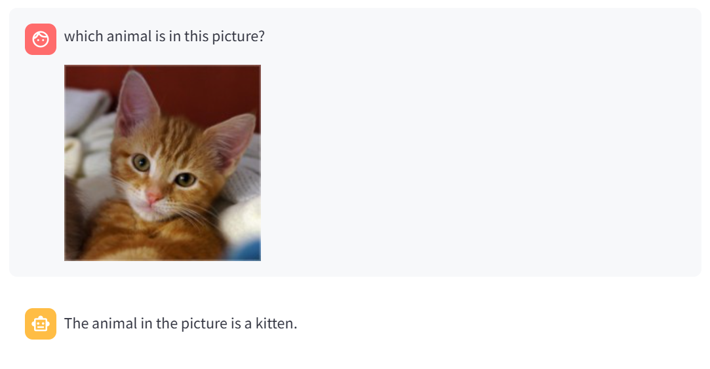

# Vision-Assistant with memory
This repo is a vision assistant bot that can handle text and image prompting  built using FastApi, Langgraph and Streamlit libraries. It uses OpenAI LLM models via Langchain ChatOpenAI. It can be adapted to other chat models as well.

### 1. Environment variables setup 
- OPENAI_API_KEY:  ## api key obtained from OpenAI
### 2. Setting up Python Environment
- Below is instructions to setup a new Python environment using Conda. In a Conda prompt, create a new environment and activate.
```yaml
$ conda create -n chatbot python=3.12
$ conda activate chatbot
```
- Install all dependencies.
```yaml
$ pip install requirements.txt
```
- Override Streamlit package with this [wheel](https://core-previews.s3-us-west-2.amazonaws.com/pr-9491/streamlit-1.39.0-py2.py3-none-any.whl). At the time of building this repo, Streamlit ```st.chat_input``` didn't have the capability for image or file: 
```yaml
$ pip install --force-reinstall -v streamlit-1.39.0-py2.py3-none-any.whl
```
### 3. Running the Vision-Assistant Bot
- First, start the Chat-Bot service:
```yaml
$ python chatbot.py
```
- Now, on another prompt window, run the command below. Start chatting on your browser http://localhost:8501/ :
```yaml
$ streamlit run streamlit_app.py
```
- Example below:



